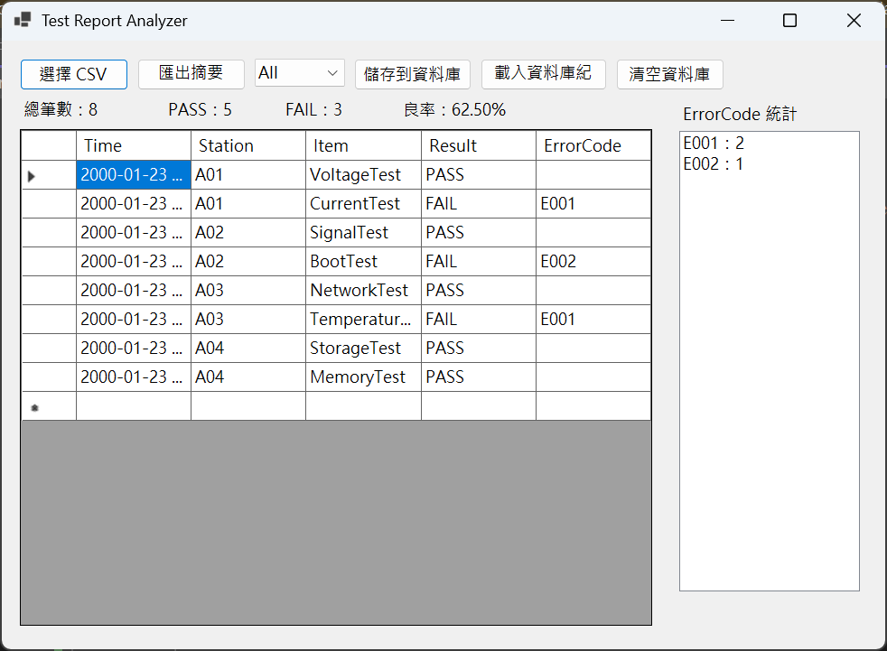

# Test Report Analyzer

## 專案簡介

Test Report Analyzer 是一個使用 C# WinForms 開發的測試報告分析工具，可匯入 CSV 測試資料，顯示測試結果表格，並統計 PASS / FAIL 數量、良率與 ErrorCode 分布，協助快速整理測試結果與產出摘要報告。

## 使用技術

* C#
* Windows Forms
* DataGridView
* CSV File I/O
* Dictionary 統計資料
* SQLite
* Microsoft.Data.Sqlite

## 功能

* 匯入 CSV 測試報告
* 顯示測試資料表格
* 依測試結果篩選資料，支援 All / PASS / FAIL
* 統計總筆數
* 統計 PASS / FAIL 數量
* 計算良率 Yield
* 統計 ErrorCode 出現次數
* 匯出摘要 CSV 報告
* 將測試資料儲存至 SQLite 資料庫
* 從 SQLite 載入歷史測試紀錄
* 清空 SQLite 測試紀錄

## 使用方式

1. 開啟程式後，點選「選擇 CSV」匯入測試報告。
2. 匯入後，測試資料會顯示於 DataGridView 表格中。
3. 程式會自動統計總筆數、PASS / FAIL 數量、良率與 ErrorCode 次數。
4. 可透過下拉選單選擇 All / PASS / FAIL，篩選畫面上顯示的測試資料。
5. 點選「匯出摘要CSV」可將分析結果輸出成摘要 CSV 報告。
6. 點選「儲存到資料庫」可將目前測試資料寫入 SQLite。
7. 點選「載入資料庫紀錄」可從 SQLite 讀取歷史測試資料。
8. 點選「清空資料庫」可刪除 SQLite 內的測試紀錄。

## CSV 格式範例

```
Time,Station,Item,Result,ErrorCode
2000-01-23 10:00:01,A01,VoltageTest,PASS,
2000-01-23 10:00:03,A01,CurrentTest,FAIL,E001
2000-01-23 10:00:05,A02,SignalTest,PASS,
2000-01-23 10:00:07,A02,BootTest,FAIL,E002
2000-01-23 10:00:09,A03,NetworkTest,PASS,
2000-01-23 10:00:11,A03,TemperatureTest,FAIL,E001
2000-01-23 10:00:13,A04,StorageTest,PASS,
2000-01-23 10:00:15,A04,MemoryTest,PASS,
```

## 匯出摘要格式

```
Category,Name,Value
Summary,Total,8
Summary,PASS,5
Summary,FAIL,3
Summary,Yield,62.50%
ErrorCode,E001,2
ErrorCode,E002,1
```

## 目前限制

目前支援簡單 CSV 格式，欄位內容不包含逗號或特殊引號。SQLite 功能目前以本機資料庫檔案儲存測試紀錄，尚未加入防止重複匯入、進階查詢與資料編輯功能。

## 執行畫面



## 版本紀錄

### v1.3

- 新增 SQLite 本機資料庫功能
- 支援將 CSV 測試資料儲存至 SQLite
- 支援從 SQLite 載入歷史測試紀錄
- 支援清空 SQLite 測試紀錄

### v1.2

- 新增 All / PASS / FAIL 篩選功能

### v1.1

- 新增摘要 CSV 匯出功能

### v1.0

- 支援 CSV 匯入、資料顯示、PASS / FAIL 統計、良率計算與 ErrorCode 統計

